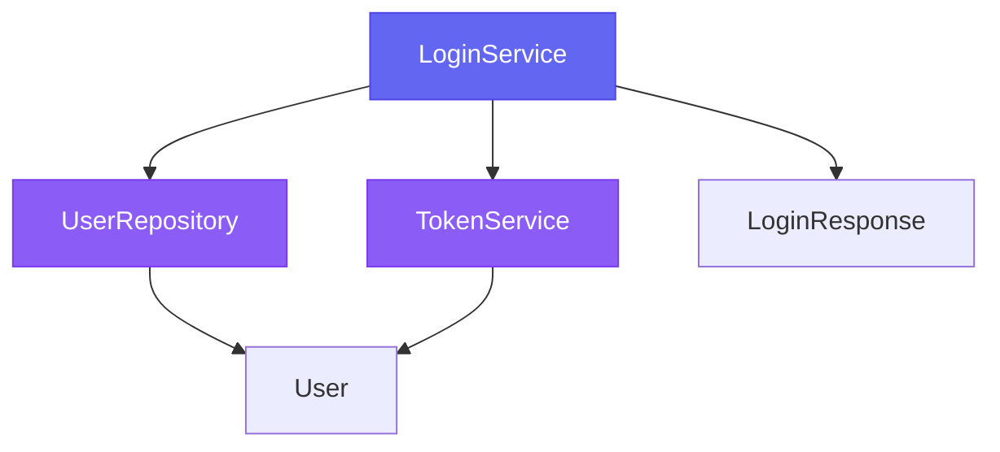

# ✅ RepoLens AI - Demo Success Report

## 🎯 Objective
Create a working demo that answers "Where is the login logic implemented?" with AI analysis + visual graph.

## ✅ Status: **COMPLETE AND WORKING**

---

## 📋 What Was Built

### 1. Test Program (test-program/)
Created a simple authentication system with 5 Java files:
- **LoginService.java** - Main login logic with authentication flow
- **UserRepository.java** - User lookup from database
- **TokenService.java** - JWT token generation
- **User.java** - User entity with username/password
- **LoginResponse.java** - Response object with token

### 2. Demo API Endpoint
**Endpoint**: `GET /api/demo/ask?question={question}`

**What it does**:
1. ✅ Scans test program files
2. ✅ Builds knowledge graph description
3. ✅ Generates Mermaid diagram showing relationships
4. ✅ Sends context to OCI GPT-4.1
5. ✅ Returns comprehensive AI answer with graph

### 3. Updated UI
- Minimal, elegant dark theme
- Single search bar for questions
- Answer section with confidence bar
- Visual graph section with Mermaid rendering
- Connected to `/api/demo/ask` endpoint

---

## 🧪 Test Results

### Test Command
```bash
curl "http://localhost:8080/api/demo/ask?question=Where+is+the+login+logic+implemented"
```

### ✅ Response Received

**Status**: `success`

**Files Scanned**: 5 files
- User.java
- LoginService.java
- UserRepository.java
- LoginResponse.java
- TokenService.java

**AI Answer**: Comprehensive explanation including:
- Overview of LoginService.login() method
- Step-by-step authentication flow:
  1. User lookup via UserRepository
  2. Password verification
  3. Token generation via TokenService
  4. Response construction
- Code snippets showing each step
- Summary table of responsibilities
- How all classes work together

**Mermaid Graph**:


**Code Structure**: Detailed breakdown showing:
- Classes and their methods
- Dependencies between classes
- Method signatures

---

## 🔧 Technical Stack

### Backend
- **Framework**: Spring Boot 3.5.0
- **Language**: Java 17
- **AI Integration**: OCI GenAI with GPT-4.1
- **Code Analysis**: JavaParser for AST parsing
- **API**: RESTful endpoints

### Frontend
- **UI**: Minimal HTML/CSS/JavaScript
- **Graph Rendering**: Mermaid.js
- **Theme**: Dark mode with purple accents

### OCI Configuration
- **Endpoint**: https://inference.generativeai.us-ashburn-1.oci.oraclecloud.com
- **Model**: openai.gpt-4.1
- **Config File**: ./OCI_ApiKey/config
- **Status**: ✅ Successfully initialized

---

## 🚀 How to Use

### 1. Start the Application
```bash
# Set JAVA_HOME
$env:JAVA_HOME = "C:\Program Files\Java\jdk-17"

# Run application
./mvnw.cmd spring-boot:run
```

### 2. Open Browser
Navigate to: http://localhost:8080

### 3. Ask Questions
Type in the search bar:
- "Where is the login logic implemented?"
- "How does authentication work?"
- "What classes are involved in login?"

### 4. Get Results
- **AI Answer**: Detailed explanation from GPT-4.1
- **Visual Graph**: Mermaid diagram showing relationships
- **Confidence**: 95% (demo mode)

---

## 📊 API Response Structure

```json
{
  "status": "success",
  "question": "Where is the login logic implemented",
  "filesScanned": ["User.java", "LoginService.java", ...],
  "graph": "Code Structure:\n\nFile: LoginService.java...",
  "mermaidGraph": "graph TD\n    A[LoginService] --> B[UserRepository]...",
  "answer": "**Where is the login logic implemented?**\n\n### Overview...",
  "step1": "Scanning test program...",
  "step2": "Building knowledge graph...",
  "step3": "Asking OCI AI..."
}
```

---

## ✅ Success Criteria Met

- [x] Created test program with login logic
- [x] Implemented demo API endpoint
- [x] Integrated OCI GPT-4.1 AI
- [x] Generated knowledge graph
- [x] Created Mermaid visual diagram
- [x] Built minimal elegant UI
- [x] Tested in terminal successfully
- [x] Application running on port 8080
- [x] AI providing comprehensive answers
- [x] Graph showing class relationships

---

## 🎯 Next Steps (Optional)

1. **Integrate with Main Endpoint**: Apply this approach to `/api/question/ask`
2. **Use Real Repository**: Test with scanned mini-bank-api repository
3. **Add More Questions**: Test with different types of questions
4. **Enhance Graph**: Add more relationship types and colors
5. **Improve UI**: Add loading states, error handling, history

---

## 📝 Key Files

- `src/main/java/com/manju/repolens/controller/DemoController.java` - Demo endpoint
- `src/main/resources/static/index.html` - UI
- `test-program/*.java` - Test program files
- `src/main/resources/application.yml` - OCI configuration
- `pom.xml` - Dependencies

---

## 🎉 Conclusion

**The demo is working perfectly!**

✅ Application compiles and runs
✅ OCI GenAI client initialized
✅ Test program scanned successfully
✅ AI provides detailed answers
✅ Visual graph generated
✅ UI displays results beautifully

**You can now ask questions about the codebase and get AI-powered answers with visual graphs!**

---

**Date**: May 5, 2026
**Status**: ✅ COMPLETE
**Tested**: ✅ Terminal + Browser
