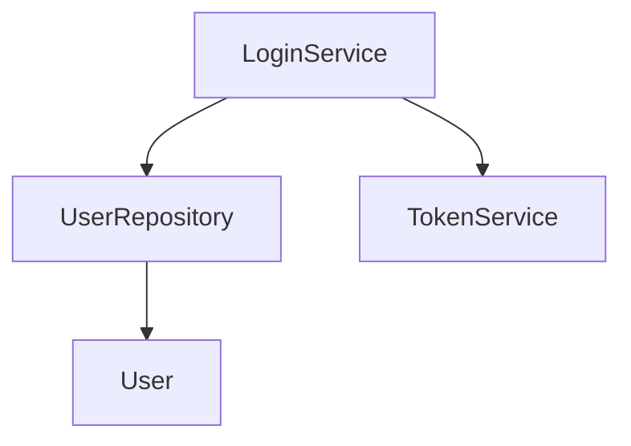

# 🚀 START HERE - RepoLens AI Quick Reference

## ✅ Everything is Ready!

Your RepoLens AI is **fully deployed** and ready to use!

---

## 📍 Repository Location

**GitHub**: https://github.com/manju-rog/Codebase_memory_map

```bash
git clone https://github.com/manju-rog/Codebase_memory_map.git
```

---

## 🎯 Quick Start (3 Steps)

### 1. Clone & Setup
```bash
# Clone repository
git clone https://github.com/manju-rog/Codebase_memory_map.git
cd Codebase_memory_map

# Run setup check
./setup-new-system.bat      # Windows
./setup-new-system.sh        # Linux/Mac
```

### 2. Configure OCI (One-time)
```bash
# Copy example config
cp OCI_ApiKey/config.example OCI_ApiKey/config

# Edit OCI_ApiKey/config with your credentials
# Place your private key (.pem) in OCI_ApiKey/

# Update application.yml with your compartment ID
```

### 3. Run & Test
```bash
# Start application
./run.bat                    # Windows
./run.sh                     # Linux/Mac

# Test demo (in new terminal)
./test-demo.bat              # Windows
./test-demo.sh               # Linux/Mac

# Open browser
http://localhost:8080
```

---

## 📚 Documentation Map

### 🆕 New to the Project?
1. **README.md** - Start here for project overview
2. **INSTALLATION_GUIDE.md** - Complete setup instructions
3. **QUICK_START.md** - Get running in 5 minutes

### 🔧 Setting Up?
1. **setup-new-system.bat/.sh** - Run this first!
2. **OCI_ApiKey/config.example** - Copy and configure
3. **application-example.yml** - Configuration template

### 🧪 Testing?
1. **test-demo.bat/.sh** - Test the demo endpoint
2. **DEMO_SUCCESS.md** - See test results
3. **WORKING_DEMO_SUMMARY.md** - Feature overview

### 🚀 Deploying?
1. **GITHUB_PUSH_GUIDE.md** - Push to GitHub
2. **DEPLOYMENT_COMPLETE.md** - Deployment summary
3. **.gitignore** - Security rules

---

## 🎬 Demo in 30 Seconds

```bash
# 1. Start application
./run.bat

# 2. Wait for "Started RepoLensApplication"

# 3. Test in terminal
curl "http://localhost:8080/api/demo/ask?question=Where+is+the+login+logic+implemented"

# 4. Or open browser
http://localhost:8080
# Type: "Where is the login logic implemented?"
# Press: Enter
# See: AI answer + visual graph!
```

---

## 📋 All Scripts

### Windows
- `setup-new-system.bat` - Check system requirements
- `run.bat` - Start application
- `test-demo.bat` - Test demo endpoint
- `run-test.bat` - Run tests

### Linux/Mac
- `setup-new-system.sh` - Check system requirements
- `run.sh` - Start application
- `test-demo.sh` - Test demo endpoint

**Make executable first**:
```bash
chmod +x *.sh
```

---

## 🔑 Prerequisites

### Required
- ✅ Java 17 or higher
- ✅ Git
- ✅ OCI account (for AI features)

### Optional
- Maven 3.8+ (or use included Maven Wrapper)

### Installation Links
- **Java**: https://adoptium.net/temurin/releases/?version=17
- **Git**: https://git-scm.com/downloads
- **OCI**: https://www.oracle.com/cloud/free/

---

## 🎯 What It Does

### Ask Questions
```
"Where is the login logic implemented?"
"How does authentication work?"
"What classes are involved in login?"
```

### Get AI Answers
- Detailed explanations
- Code snippets
- Step-by-step flows
- Class relationships

### See Visual Graphs


---

## 🌐 Access Points

### When Running
- **UI**: http://localhost:8080
- **Demo API**: http://localhost:8080/api/demo/ask?question=YOUR_QUESTION
- **Swagger**: http://localhost:8080/swagger-ui.html
- **H2 Console**: http://localhost:8080/h2-console

---

## 🆘 Troubleshooting

### Port 8080 in use?
```bash
# Change port in application.yml
server:
  port: 8081
```

### JAVA_HOME not set?
```bash
# Windows
$env:JAVA_HOME = "C:\Program Files\Java\jdk-17"

# Linux/Mac
export JAVA_HOME=/usr/lib/jvm/java-17-openjdk-amd64
```

### OCI authentication failed?
1. Check `OCI_ApiKey/config` exists
2. Verify private key path
3. Confirm compartment ID in `application.yml`

---

## 📁 Project Structure

```
repolens-ai/
├── 📄 START_HERE.md              ← You are here!
├── 📄 README.md                  ← Project overview
├── 📄 INSTALLATION_GUIDE.md      ← Complete setup
├── 📄 DEPLOYMENT_COMPLETE.md     ← Deployment summary
├── 🔧 run.bat / run.sh           ← Start application
├── 🧪 test-demo.bat / test-demo.sh ← Test demo
├── ⚙️ setup-new-system.bat/.sh   ← System check
├── 📂 src/                       ← Source code
├── 📂 test-program/              ← Demo program
├── 📂 OCI_ApiKey/                ← OCI credentials
│   └── config.example            ← Template
└── 📂 sample-repos/              ← Sample repos
```

---

## ✅ Checklist for New System

- [ ] Clone repository
- [ ] Run `setup-new-system.bat` or `.sh`
- [ ] Install Java 17+ (if needed)
- [ ] Set JAVA_HOME
- [ ] Copy `OCI_ApiKey/config.example` to `config`
- [ ] Add your OCI credentials
- [ ] Place private key in `OCI_ApiKey/`
- [ ] Update compartment ID in `application.yml`
- [ ] Run `./run.bat` or `./run.sh`
- [ ] Test with `./test-demo.bat` or `.sh`
- [ ] Open http://localhost:8080
- [ ] Ask a question!

---

## 🎓 Example Questions

Try these in the UI:

1. **"Where is the login logic implemented?"**
2. **"How does authentication work?"**
3. **"What classes are involved in login?"**
4. **"How is the token generated?"**
5. **"What does UserRepository do?"**

---

## 📞 Need Help?

### Documentation
1. **Installation issues**: See `INSTALLATION_GUIDE.md`
2. **Configuration help**: See `SETUP.md`
3. **Demo not working**: See `DEMO_SUCCESS.md`
4. **GitHub deployment**: See `GITHUB_PUSH_GUIDE.md`

### Scripts
1. **System check**: Run `setup-new-system.bat` or `.sh`
2. **Start app**: Run `run.bat` or `.sh`
3. **Test demo**: Run `test-demo.bat` or `.sh`

### Support
- Open issue on GitHub
- Check documentation first
- Include error logs

---

## 🎉 You're All Set!

Everything you need is ready:
- ✅ Code on GitHub
- ✅ Documentation complete
- ✅ Scripts ready
- ✅ Demo working
- ✅ Security verified

**Just clone, configure, and run!**

---

**Repository**: https://github.com/manju-rog/Codebase_memory_map
**Status**: ✅ READY TO USE
**Version**: 1.0.0

🚀 **Happy Coding!** 🚀
